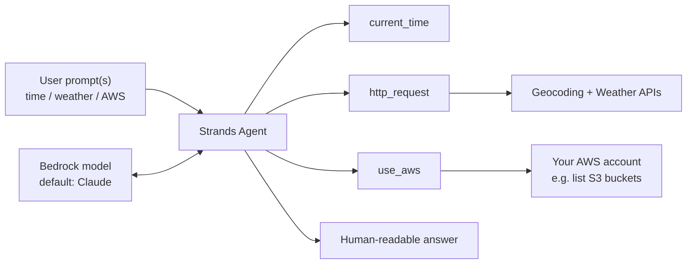
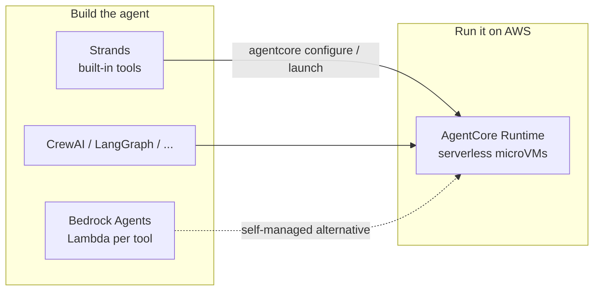
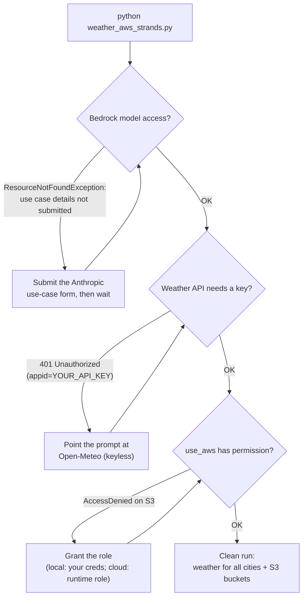
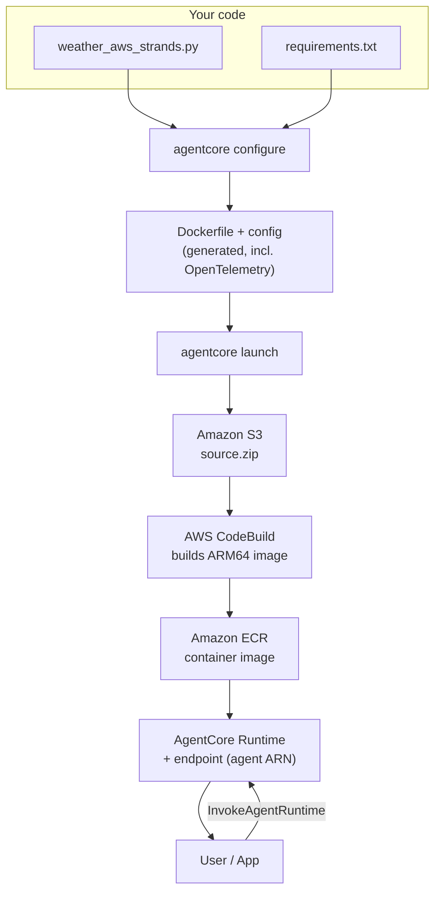
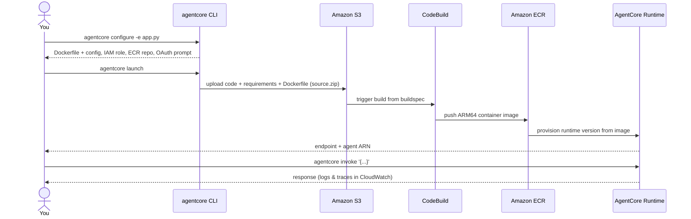
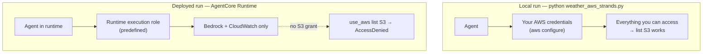

# AWS Strands Agents

**Ask about the weather in plain English.** A Strands agent, backed by an Amazon
Bedrock model, that answers time / weather / AWS questions in one go — choosing and
calling tools on its own — and deploys to **Amazon Bedrock AgentCore** with two
commands.


-146EB4)

> Ask "what's the time and weather in New York, and list my S3 buckets?" in one
> message — the agent figures out which tools to call, in what order, and how many
> times, with no routing code from you.

## Contents

- [What it does](#what-it-does)
- [How it works](#how-it-works)
- [Tools](#tools)
- [Where AgentCore fits](#where-agentcore-fits)
- [Project files](#project-files)
- [Quickstart](#quickstart)
- [Getting it running](#getting-it-running)
- [Deploy to AgentCore](#deploy-to-agentcore)
- [Runtime permissions: local vs deployed](#runtime-permissions-local-vs-deployed)
- [Observability](#observability)
- [AgentCore capabilities](#agentcore-capabilities)
- [Example prompts](#example-prompts)
- [Troubleshooting](#troubleshooting)
- [License](#license)

## What it does

- Accepts questions about time, weather, and your AWS account — even several unrelated ones in a single prompt
- Fetches weather and geocoding data from public APIs
- Returns clear, human-readable answers
- Chooses and invokes the right tools autonomously — and may call the same tool more than once, in whatever order it needs
- Handles unavailable or invalid data gracefully

There is no hand-written "if the user asks X, call tool Y" logic — the agent decides.

## How it works

A Strands **agent** sits between the user and a Bedrock model, calling built-in
tools as needed:



If you don't specify a model, Strands defaults to a Claude model in your Bedrock
account (Claude Sonnet 4 at the time of writing). Locally, it reaches Bedrock using
the credentials from `aws configure`.

## Tools

The agent uses Strands' built-in tools — no schemas or descriptions to write:

| Tool | What it does |
| --- | --- |
| `current_time` | Returns the current time |
| `http_request` | Calls HTTP APIs (used here for geocoding and weather) |
| `use_aws` | Answers questions about your AWS account in plain English (e.g. list S3 buckets) |

Strands ships a library of ready-made tools (around 20), and you can add your own —
all in one concise codebase, with no per-tool Lambda functions to build.

Because `http_request` can call any URL, the agent picks the weather API itself. Left
alone it tends to reach for a keyed provider (OpenWeatherMap) and fail on the missing
key, so the system prompt steers it to **Open-Meteo** (`open-meteo.com`) — geocoding
and forecast endpoints that need **no API key**. That keeps the whole demo running on
nothing but your AWS credentials.

## Where AgentCore fits

It helps to separate **building** an agent from **running** it on AWS.

| | Bedrock Agents | Strands | AgentCore |
| --- | --- | --- | --- |
| Layer | Build (first-gen) | Build (framework) | **Run / host** |
| Tools | One Lambda per tool, via action groups | Built-in + custom, one codebase | hosts whatever you built |
| Tool wiring | You write descriptions & parameters | Automatic — no descriptions needed | — |
| Models | Bedrock-hosted only | Bedrock **or** external (API key) | — |
| Code footprint | Several Lambdas to build & test | A single concise program | Two commands to deploy |
| Infrastructure | Managed | Yours, until you host it | Serverless microVMs, fully managed |

AgentCore isn't a competing framework — it's the **runtime**. You build with Strands
(or CrewAI, LangGraph, etc.) and deploy onto AgentCore:



## Project files

```text
StrandsAgents/
├── weather_aws_strands.py   # main agent script (the AgentCore entrypoint)
├── requirements.txt         # deps: strands-agents, strands-agents-tools, bedrock-agentcore
├── agents/                  # local virtual environment
└── README.md
```

## Quickstart

**Prerequisites**

- Python 3.10+
- AWS credentials configured for Bedrock access
- Model access granted for the Bedrock model you use (request it in the Bedrock console)

**Set up and install**

```bash
cd StrandsAgents
# Windows PowerShell
.\agents\Scripts\Activate.ps1
# macOS / Linux
source agents/bin/activate

pip install -r requirements.txt
```

**Configure AWS credentials**

```bash
aws configure
# or set environment variables
export AWS_ACCESS_KEY_ID=your_access_key
export AWS_SECRET_ACCESS_KEY=your_secret_key
export AWS_REGION=us-west-2
```

**Run locally**

```bash
python weather_aws_strands.py
```

## Getting it running

A first run rarely works cold. Here's the path from a fresh clone to a clean run,
and the fix at each gate:



What each gate means:

1. **Bedrock model access.** Anthropic models need a one-time **use-case form** before they'll answer. The old "Model access" console page is retired — serverless models auto-enable on first invocation, but Claude still surfaces the form when you open it in the Model catalog / Playground or call `InvokeModel`/`Converse`. It appears as `ResourceNotFoundException: Model use case details have not been submitted`. In an org with SCPs, also confirm no Service Control Policy denies Bedrock. Region and model id must match (here `us-west-2` / `global.anthropic.claude-sonnet-4-6`).
2. **Keyless weather API.** The agent defaults to a keyed provider and fails with `401 Unauthorized` and a literal `appid=YOUR_API_KEY`. Steering the prompt to **Open-Meteo** removes the key entirely — geocoding then forecast, both `200 OK`.
3. **`use_aws` permissions.** Locally this uses your own credentials, so it just works. Once deployed, it runs under the runtime execution role — grant that role the services your tools touch (see [Runtime permissions](#runtime-permissions-local-vs-deployed)).

Once all three clear, a single prompt returns time + weather for every city and your
S3 bucket list — and the agent self-corrects along the way (for example, retrying a
geocoding lookup with an explicit country when the first search returns no match).

## Deploy to AgentCore

Deployment turns your script and `requirements.txt` into a container and hosts it on
a managed **AgentCore Runtime** with an HTTPS endpoint — all from two commands.



**One-time: expose an AgentCore entrypoint.** To deploy, wrap the agent in the
AgentCore app so the runtime knows where execution starts:

```python
from bedrock_agentcore import BedrockAgentCoreApp

app = BedrockAgentCoreApp()

@app.entrypoint
def invoke(payload):
    prompt = payload.get("prompt", "")
    return agent(prompt)          # your Strands agent — the rest of the code is unchanged

if __name__ == "__main__":
    app.run()
```

**Deploy**

```bash
pip install bedrock-agentcore-starter-toolkit

# Interactive: creates the execution role, an ECR repo, detects requirements.txt,
# offers an OAuth authorizer, and writes a Dockerfile + bedrock_agentcore.yaml.
agentcore configure -e weather_aws_strands.py

# CodeBuild builds an ARM64 image (no local Docker), pushes to ECR,
# provisions the runtime, wires CloudWatch, and prints the agent ARN.
agentcore launch

agentcore launch --local     # optional: build & run locally at http://localhost:8080
agentcore invoke '{"prompt": "What is the weather in Tokyo, Japan?"}'
```

**What `agentcore launch` creates**, step by step:



You can watch each artifact appear: an S3 bucket like
`bedrock-agentcore-...codebuild` holding `source.zip`, a CodeBuild project running
the buildspec (think Jenkinsfile), the image in an ECR repo, and a versioned runtime
under **Bedrock AgentCore → Agent Runtime**. The runtime defaults to **us-west-2**.

## Runtime permissions: local vs deployed

This trips everyone up once. Locally, the agent uses **your** AWS credentials, so
`use_aws` can do anything you can. Deployed, it runs under the **runtime execution
role**, which by default only has Bedrock and CloudWatch access — so a tool that
touches other services fails until you grant it.



**Fix:** find the runtime role (name starts `AmazonBedrockAgentCoreSDKRuntime-*`, or
read it from the launch output / CloudWatch logs) and attach the permissions your
tools need — for the S3 example, `AmazonS3ReadOnlyAccess`. Grant the least privilege
that makes the tool work; don't widen it further than necessary.

## Observability

`agentcore configure` adds **OpenTelemetry** to the generated Dockerfile, so the
deployed agent emits traces and metrics automatically. In **CloudWatch → GenAI
Observability** you get per-invocation traces, latency, and token metrics, and the
launch process creates log groups such as
`/aws/bedrock-agentcore/runtimes/<agent>-<id>`. To see traces, enable **CloudWatch
Transaction Search**. When a deployed tool misbehaves (like the S3 case above), the
runtime's log group is the first place to look.

## AgentCore capabilities

Beyond hosting this one agent, AgentCore Runtime offers:

- **Serverless microVMs** — each agent runs isolated on managed microVMs; no compute, load balancer, or scaling for you to operate.
- **Built-in GenAI observability** — tracing, metrics, and logs wired up automatically (see above).
- **Bring your own framework** — Strands, CrewAI, LangGraph, or others; AgentCore hosts the container regardless of framework.
- **Turn APIs/Lambdas into MCP tools** — expose existing Lambda functions or APIs to agents as MCP servers via AgentCore Gateway.
- **Auth built in** — the `configure` step can set up an OAuth authorizer so the endpoint is protected without extra code.

## Example prompts

```text
What is the current weather in New York City?
What's the time and weather in Tokyo, Japan, and how many S3 buckets do I have?
Check the weather in London, UK.
How is the weather in Sydney, Australia?
```

## Troubleshooting

- **`NoCredentialsError` (local)** — run `aws configure`, or set `AWS_ACCESS_KEY_ID` / `AWS_SECRET_ACCESS_KEY` / `AWS_REGION`.
- **`ResourceNotFoundException: Model use case details have not been submitted`** — this is model access, not a missing resource. The console "Model access" page is retired; open the Anthropic model in the Model catalog / Playground (or call `InvokeModel`/`Converse`) to trigger the one-time **use-case form**, submit it, and retry after ~15 minutes. Match the region and model id in the error.
- **Weather calls return `401 Unauthorized` with `appid=YOUR_API_KEY`** — the agent chose a keyed provider (OpenWeatherMap) and has no key. Steer the prompt to a keyless API like **Open-Meteo**; no key needed.
- **`AccessDenied` from a tool after deploying** — the runtime execution role lacks that service's permission (see [Runtime permissions](#runtime-permissions-local-vs-deployed)). Attach the needed policy to the runtime role.
- **`AccessDeniedException` on Bedrock** — the role lacks `bedrock:InvokeModel`, or an org **SCP** denies Bedrock. Check both; the SCP is an admin-level fix.
- **Deploy fails creating roles / CodeBuild / ECR** — your caller identity lacks the toolkit's operational permissions; supply pre-created role ARNs to `agentcore configure` or widen your permissions.
- **Wrong region** — the runtime defaults to `us-west-2`; set your region explicitly if your model or resources live elsewhere.
- **`current_time` deprecation warning** — becomes an error log in `strands_tools` v0.9.0; migrate to injecting the time as context (`ContextInjector`).

> **Preview & tooling note.** AgentCore is in **preview** and evolving quickly; AWS
> now also publishes a newer standalone AgentCore CLI alongside the
> `bedrock-agentcore-starter-toolkit` used here. Confirm current command names
> against the AWS docs before a production rollout.

## License

Provided as a sample/demo project for educational and local experimentation. Add a
formal license (MIT, Apache-2.0, etc.) before sharing or distributing.